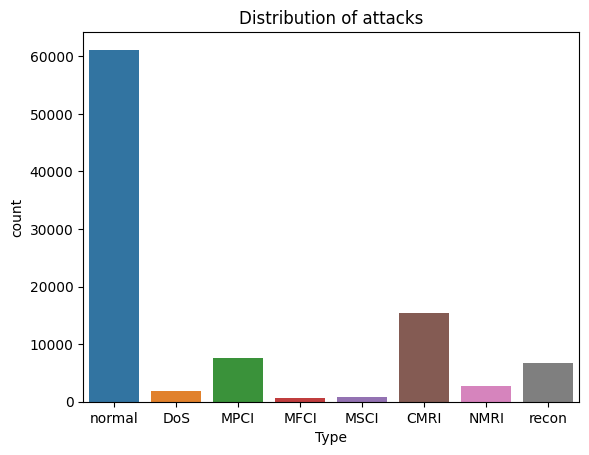
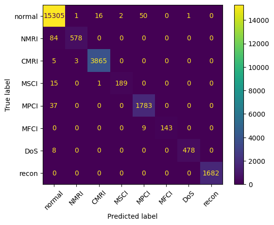

## Capstone Project: Detecting and Classifying Attacks on Industrial Systems

This is the capstone project for UC Berkeley's [Professional Certificate in ML &amp; AI](https://em-executive.berkeley.edu/professional-certificate-machine-learning-artificial-intelligence?advocate_program=01t2s000000ZqNbAAK&advocate_source=dashboard&coupon=IXFD6%3A11-8KE65G8&utm_campaign=incentivized_referrals&utm_content=SO+-+Berkeley+Professional+Certificate+in+ML+%26+AI&utm_medium=personal_url&utm_placement=dashboard&utm_source=referral&utm_term=U4i1l80W3GTaStzCNlN16AsmRVmMs3322wkrdiFJJXDjWY2Kl%2FSmYByqk28Z1wpPBt57rCVH9fEKu%2Bj%2B%2B2MnNXlRmW48YqIE%2Ff68xD%2BvB2eWYj%2BrPjaTIMN4--cMEm5pJ85sMlQO6a--ybrOaW%2FFOItWpgIey12Duw%3D%3D#referrals-email-capture-modal).

**Note: this project is a work in progress. Content is subject to change.**

## Context and objective

Cyberattacks are a major issue in the industrial sector. As the number of connected systems and devices, so do the costs of cybercrime and malware. An attack on critical infrastructure could lead to serious consequences. However, artificial intelligence can be leveraged to analyze data and alert users of anomalies in real time. The ability to automatically detect and mitigate threats makes AI an invaluable tool in the modern world.

This captone project examines data from an industrial control system for a gas pipeline as described in the paper "[Industrial Control System Network Traffic Data sets to Facilitate Intrusion Detection System Research](https://link.springer.com/chapter/10.1007/978-3-662-45355-1_5)" by Tommy Morris and Wei Gao. It aims to create a model to detect and classify simulated attacks, as well as provide insights on how artificial intelligence could be used to mitigate cyber threats in our increasingly connected world.

## Data

The data set contains the following 27 features:

* Attributes of command-response pair
  * `command_address` - device ID in command packet
  * `response_address` - device ID in reponse packet
  * `command_memory` - memory address in command packet
  * `response_memory` - memory address in reponse packet
  * `command_memory_count` - bytes in memory for read and write command
  * `response_memory_count` - bytes in memory for read and write response
  * `command_length` - length of command packet
  * `resp_length` - length of response packet
  * `time` - elapsed time between command and response
  * `crc_rate` - CRC error rate
* Packet payload attributes
  * `comm_read_function` - value of read command function code
  * `comm_write_fun` - value of write command function code
  * `resp_read_fun` - value of read response function code
  * `resp_write_fun` - value of read response function code
  * `sub_function` - value of sub-function code
  * `measurement` - pipeline pressure
  * `control_mode` - categorical variable indicating the system's control mode (0 = shutdown, 1 = manual, 2 = automatic)
  * `pump` - categorical variable indicating the pipeline's compressor state (0 = inactive, 1 = active)
* Gas pipeline attributes
  * `setpoint` - configured gas pipeline pressure
  * `control_scheme` - gas pipeline control scheme
  * `solenoid` - state of the solenoid used to control the pressure relief valve (0 = inactive, 1 = active)
  * `gain` - value of gain parameter in PID controller
  * `reset` - value of reset parameter in PID controller
  * `deadband` - value of dead gain parameter in PID controller
  * `rate` - value of rate parameter in PID controller
  * `cycletime` - value of cycle time parameter in PID controller
* Target variable
  * `result` - manual classification of the attack type (0 = not an attack)

The `id` column was automatically created during the ARFF to CSV conversion process. Because each item under `id` has a unique value, this is a non-informative feature that will be removed during the data cleaning step. Furthermore, some features in the data set did not match those described in the paper. The features that were mentioned in the paper but absent from the data set are not listed here.

## Data cleaning

* The data has no missing values
* A number of columns have only one unique value; these are removed as part of the data cleaning process
* The `measurement` column contains some obviously incorrect values; these are replaced with the median value

## Findings

* About a third of all packets are part of an attack
* Four models were used: decision trees, random forests, histogram-based gradient boosting machines and Light GBM. All four models gave very high predictive performance. Out of those four models, the histogram-based gradient-boosting machine had the highest accuracy
* For the decision tree and random forest classifiers, dropping low-importance features resulted in a very slight drop in accuracy but did not significantly affect the time needed to train the models
* Light GBM has the second-best accuracy but the shortest training time

## Sample visualizations

* Distribution of attack types

* Feature importance from decision tree

* Confusion matrix of gradient-boosting machine

